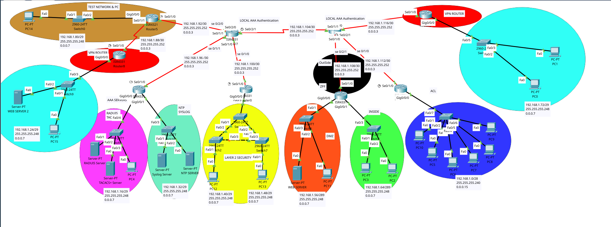

*note: sorry for not using git from the beginning*

## Todo

- [x] subnetting
- [x] giving devices IPs
- [x] Split The Yellow Network Into 2 Vlans (one for switches and the other for PCs)
- [x] Routing Using OSPF
- [x] OSPF Authentication
- [x] Basic Configurations For Network Devices (usernames, passwords and ssh)
- [x] Implement NTP for Network Devices
- [x] Implement SYSLOG For Network Devices
- [x] Implement AAA for Network Devices
- [x] Implement Layer 2 Security for The Yellow Network (port security)
- [x] Implement VPN Connection From R2 -> R8

## Subnets:
 [See subnets.pdf](Assets/subnets.pdf) for more details.
